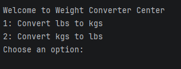
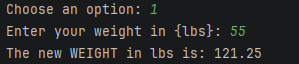
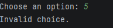

Weight Conversion Program

v1_basic     - basic procedural version
v2_oop  - OOP version

Most programs have been upgraded to a v2_oop version to demonstrate
improvement using Object-Oriented Programming.

A few very small programs were intentionally left as single-class
implementations, as converting them into multiple classes would not
add meaningful value.

## Screenshots

### Version 1 (Basic)

### Version 2 (OOP)

